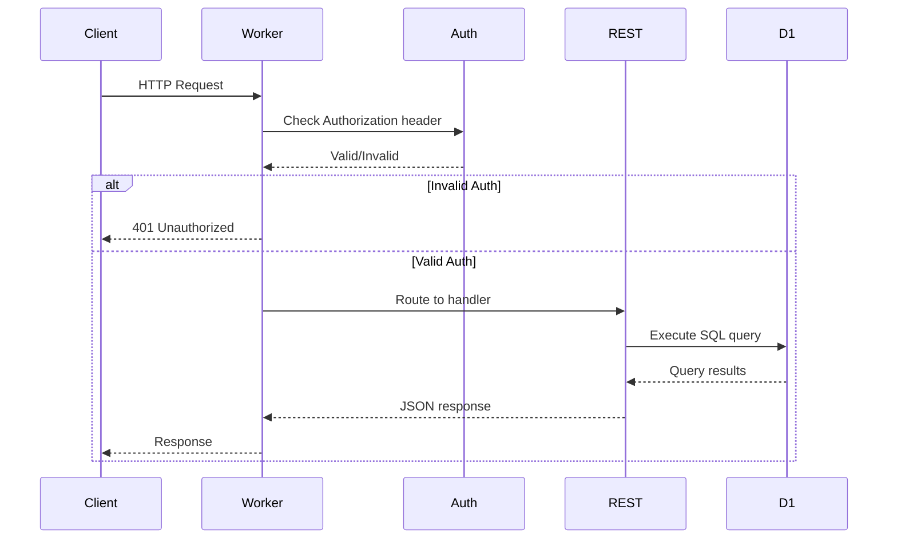

# Cloudflare D1 101 Learning Guide

## Overview

This guide will help you learn Cloudflare Workers and D1 database step by step using the `d1-rest` project. You'll learn how to create tables, perform CRUD operations, and understand how the code works.

## Project Architecture

### What is this project?

This is a **Cloudflare Worker** that provides a REST API interface to a **D1 database**. Think of it as:
- **Cloudflare Worker**: Serverless code that runs on Cloudflare's edge network (close to users worldwide)
- **D1 Database**: SQLite-based database that runs on Cloudflare's edge
- **Hono**: A lightweight web framework for building APIs

### Key Components

```
┌─────────────┐
│   Client    │ (curl, browser, etc.)
└──────┬──────┘
       │ HTTP Request
       ▼
┌─────────────────────────────────────┐
│  Cloudflare Worker (src/index.ts)   │
│  - Hono web framework               │
│  - Authentication middleware        │
│  - Route handlers                   │
└──────┬──────────────────────────────┘
       │
       ├──────────────┬──────────────┐
       ▼              ▼              ▼
┌─────────────┐ ┌──────────┐ ┌─────────────┐
│ /rest/*     │ │ /query   │ │ Auth        │
│ (CRUD ops)  │ │ (Raw SQL)│ │ Middleware  │
└──────┬──────┘ └────┬─────┘ └─────────────┘
       │             │
       └──────┬──────┘
              ▼
┌─────────────────────────────────────┐
│  D1 Database (cf-demo-db)           │
│  - SQLite-based                     │
│  - Edge-optimized                   │
└─────────────────────────────────────┘
```

### Configuration Files

1. **[`npx wrangler.jsonc`](../npx wrangler.jsonc)**: Cloudflare Workers configuration
   - Defines the D1 database binding (`DB`)
   - Defines the secret store binding (`SECRET`)
   - Sets compatibility date and other settings

2. **[`src/index.ts`](../src/index.ts)**: Main entry point
   - Sets up Hono app
   - Implements authentication middleware
   - Defines routes (`/rest/*` and `/query`)

3. **[`src/rest.ts`](../src/rest.ts)**: REST API handlers
   - `handleGet()`: Fetch records (list or single)
   - `handlePost()`: Create new records
   - `handleUpdate()`: Update existing records
   - `handleDelete()`: Delete records

---

## Step 1: Understanding the Architecture

### Cloudflare Workers
- Serverless functions that run on Cloudflare's global edge network
- Written in JavaScript/TypeScript
- Deployed with the `npx wrangler` CLI tool
- Can access D1 databases, KV storage, R2 buckets, etc.

### D1 Database
- SQLite-based database optimized for the edge
- Supports standard SQL queries
- Automatically replicated across Cloudflare's network
- Accessed via bindings in Workers

### How it works together:
1. You deploy a Worker with a D1 database binding
2. The Worker can execute SQL queries against the database
3. Requests to the Worker trigger your code
4. Your code interacts with D1 using the `env.DB` binding

How to Secure This for Public Deployment
1. Use a Strong Secret
Generate a cryptographically secure secret:

# Generate a random secret
openssl rand -base64 32
Then update it in Cloudflare:

npx wrangler secret put SECRET

---

## Step 2: Create a Users Table in D1

### Prerequisites
Make sure you have:
- Node.js installed
- npx wrangler CLI installed (`npm install -g npx wrangler`)
- Logged in to Cloudflare (`npx wrangler login`)

### Creating the table

Use the npx wrangler CLI to execute SQL commands against your D1 database:

```bash
# Execute SQL to create a users table
npx wrangler d1 execute cf-demo-db --remote --command "CREATE TABLE IF NOT EXISTS users (
    id INTEGER PRIMARY KEY AUTOINCREMENT,
    name TEXT NOT NULL,
    email TEXT NOT NULL UNIQUE,
    age INTEGER,
    created_at DATETIME DEFAULT CURRENT_TIMESTAMP
);"
```

**Explanation:**
- `npx wrangler d1 execute`: Command to run SQL against D1
- `cf-demo-db`: The database name (from [`npx wrangler.jsonc`](../npx wrangler.jsonc:13))
- `--remote`: Execute on the remote database (not local)
- `--command`: The SQL statement to execute

**Table Schema:**
- `id`: Auto-incrementing primary key
- `name`: User's name (required)
- `email`: User's email (required, must be unique)
- `age`: User's age (optional)
- `created_at`: Timestamp when record was created (automatic)

---

## Step 3: Verify the Table Was Created

Check that the table exists and see its structure:

```bash
# List all tables
npx wrangler d1 execute cf-demo-db --remote --command "SELECT name FROM sqlite_master WHERE type='table';"

# Get table schema
npx wrangler d1 execute cf-demo-db --remote --command "PRAGMA table_info(users);"
```

Expected output for `PRAGMA table_info(users);`:
```
┌──────┬───────────┬──────────┬──────────┬──────────┬────────┐
│ cid  │ name      │ type     │ notnull  │ dflt_value │ pk    │
├──────┼───────────┼──────────┼──────────┼──────────┼────────┤
│ 0    │ id        │ INTEGER  │ 1        │          │ 1      │
│ 1    │ name      │ TEXT     │ 1        │          │ 0      │
│ 2    │ email     │ TEXT     │ 1        │          │ 0      │
│ 3    │ age       │ INTEGER  │ 0        │          │ 0      │
│ 4    │ created_at│ DATETIME │ 0        │ CURRENT_TIMESTAMP │ 0 │
└──────┴───────────┴──────────┴──────────┴──────────┴────────┘
```

---

## Step 4: Create Users via POST /rest/users

Now let's test the REST API to create users. The API is already deployed at `https://d1-rest.amite.workers.dev`.

### Create your first user:

```bash
curl --location 'https://d1-rest.amite.workers.dev/rest/users' \
--header 'Authorization: Bearer secret' \
--header 'Content-Type: application/json' \
--data '{
    "name": "John Doe",
    "email": "john@example.com",
    "age": 30
}'
```

**What happens:**
1. Request goes to [`/rest/users`](../src/rest.ts:158)
2. [`handlePost()`](../src/rest.ts:83) function is called
3. It sanitizes column names and builds an INSERT query
4. Executes: `INSERT INTO users (name, email, age) VALUES (?, ?, ?)`
5. Returns success message with the created data

**Expected Response:**
```json
{
    "message": "Resource created successfully",
    "data": {
        "name": "John Doe",
        "email": "john@example.com",
        "age": 30
    }
}
```

### Create more users:

```bash
# User 2
curl --location 'https://d1-rest.amite.workers.dev/rest/users' \
--header 'Authorization: Bearer secret' \
--header 'Content-Type: application/json' \
--data '{
    "name": "Alice Smith",
    "email": "alice@example.com",
    "age": 25
}'

# User 3
curl --location 'https://d1-rest.amite.workers.dev/rest/users' \
--header 'Authorization: Bearer secret' \
--header 'Content-Type: application/json' \
--data '{
    "name": "Bob Johnson",
    "email": "bob@example.com",
    "age": 35
}'
```

---

## Step 5: Read Users via GET /rest/users

### Get all users:

```bash
curl --location 'https://d1-rest.amite.workers.dev/rest/users' \
--header 'Authorization: Bearer secret'
```

**What happens:**
1. Request goes to [`/rest/users`](../src/rest.ts:158)
2. [`handleGet()`](../src/rest.ts:21) function is called
3. Builds query: `SELECT * FROM users`
4. Executes and returns all records

**Expected Response:**
```json
{
    "success": true,
    "meta": {
        "served_by": "v3-prod",
        "duration": 0.1746,
        "rows_read": 3,
        "rows_written": 0
    },
    "results": [
        {
            "id": 1,
            "name": "John Doe",
            "email": "john@example.com",
            "age": 30,
            "created_at": "2025-12-26 12:00:00"
        },
        {
            "id": 2,
            "name": "Alice Smith",
            "email": "alice@example.com",
            "age": 25,
            "created_at": "2025-12-26 12:01:00"
        },
        {
            "id": 3,
            "name": "Bob Johnson",
            "email": "bob@example.com",
            "age": 35,
            "created_at": "2025-12-26 12:02:00"
        }
    ]
}
```

### Get a single user by ID:

```bash
curl --location 'https://d1-rest.amite.workers.dev/rest/users/1' \
--header 'Authorization: Bearer secret'
```

**What happens:**
1. Request goes to [`/rest/users/1`](../src/rest.ts:158)
2. [`handleGet()`](../src/rest.ts:21) is called with `id = "1"`
3. Builds query: `SELECT * FROM users WHERE id = ?`
4. Returns the specific user

---

## Step 6: Filter and Sort Users

### Filter by age:

```bash
curl --location 'https://d1-rest.amite.workers.dev/rest/users?age=25' \
--header 'Authorization: Bearer secret'
```

**What happens:**
1. [`handleGet()`](../src/rest.ts:21) parses query parameters
2. Builds query: `SELECT * FROM users WHERE age = ?`
3. Binds the value `25` and executes

### Multiple filters:

```bash
curl --location 'https://d1-rest.amite.workers.dev/rest/users?age=30&name=John%20Doe' \
--header 'Authorization: Bearer secret'
```

**Query:** `SELECT * FROM users WHERE age = ? AND name = ?`

### Sort users:

```bash
# Sort by age ascending
curl --location 'https://d1-rest.amite.workers.dev/rest/users?sort_by=age&order=asc' \
--header 'Authorization: Bearer secret'

# Sort by name descending
curl --location 'https://d1-rest.amite.workers.dev/rest/users?sort_by=name&order=desc' \
--header 'Authorization: Bearer secret'
```

**Query:** `SELECT * FROM users ORDER BY age ASC`

### Pagination:

```bash
# Get first 2 users
curl --location 'https://d1-rest.amite.workers.dev/rest/users?limit=2' \
--header 'Authorization: Bearer secret'

# Skip first user, get next 2
curl --location 'https://d1-rest.amite.workers.dev/rest/users?limit=2&offset=1' \
--header 'Authorization: Bearer secret'
```

**Query:** `SELECT * FROM users LIMIT ? OFFSET ?`

### Combined example:

```bash
curl --location 'https://d1-rest.amite.workers.dev/rest/users?age=25&sort_by=name&order=desc&limit=10' \
--header 'Authorization: Bearer secret'
```

**Query:** `SELECT * FROM users WHERE age = ? ORDER BY name DESC LIMIT ?`

---

## Step 7: Update a User via PATCH /rest/users/{id}

### Update user's age:

```bash
curl --location --request PATCH 'https://d1-rest.amite.workers.dev/rest/users/1' \
--header 'Authorization: Bearer secret' \
--header 'Content-Type: application/json' \
--data '{
    "age": 31
}'
```

**What happens:**
1. Request goes to [`/rest/users/1`](../src/rest.ts:158) with PATCH method
2. [`handleUpdate()`](../src/rest.ts:110) is called
3. Builds query: `UPDATE users SET age = ? WHERE id = ?`
4. Binds values `[31, 1]` and executes

**Expected Response:**
```json
{
    "message": "Resource updated successfully",
    "data": {
        "age": 31
    }
}
```

### Update multiple fields:

```bash
curl --location --request PATCH 'https://d1-rest.amite.workers.dev/rest/users/2' \
--header 'Authorization: Bearer secret' \
--header 'Content-Type: application/json' \
--data '{
    "name": "Alice Johnson",
    "email": "alice.johnson@example.com",
    "age": 26
}'
```

**Query:** `UPDATE users SET name = ?, email = ?, age = ? WHERE id = ?`

---

## Step 8: Delete a User via DELETE /rest/users/{id}

### Delete a user:

```bash
curl --location --request DELETE 'https://d1-rest.amite.workers.dev/rest/users/3' \
--header 'Authorization: Bearer secret'
```

**What happens:**
1. Request goes to [`/rest/users/3`](../src/rest.ts:158) with DELETE method
2. [`handleDelete()`](../src/rest.ts:140) is called
3. Builds query: `DELETE FROM users WHERE id = ?`
4. Binds value `3` and executes

**Expected Response:**
```json
{
    "message": "Resource deleted successfully"
}
```

---

## Step 9: Understanding the Code Flow

### Request Flow Diagram



### Code Walkthrough

#### 1. Entry Point ([`src/index.ts`](../src/index.ts:31))

```typescript
export default {
    async fetch(request: Request, env: Env, ctx: ExecutionContext): Promise<Response> {
        const app = new Hono<{ Bindings: Env }>();
        // ... setup middleware and routes
        return app.fetch(request, env, ctx);
    }
}
```

- Cloudflare Workers call the `fetch` function for each request
- `env` contains bindings (DB, SECRET)
- `ctx` is the execution context

#### 2. Authentication Middleware ([`src/index.ts`](../src/index.ts:45))

```typescript
const authMiddleware = async (c: Context, next: Next) => {
    const authHeader = c.req.header('Authorization');
    if (!authHeader) {
        return c.json({ error: 'Unauthorized' }, 401);
    }

    const token = authHeader.startsWith('Bearer ')
        ? authHeader.substring(7)
        : authHeader;

    if (token !== secret) {
        return c.json({ error: 'Unauthorized' }, 401);
    }

    return next();
};
```

- Checks for `Authorization: Bearer secret` header
- Compares token with the secret from Cloudflare Secrets Store
- Returns 401 if invalid, calls `next()` if valid

#### 3. REST Handler ([`src/rest.ts`](../src/rest.ts:158))

```typescript
export async function handleRest(c: Context<{ Bindings: Env }>): Promise<Response> {
    const url = new URL(c.req.url);
    const pathParts = url.pathname.split('/').filter(Boolean);
    
    const tableName = pathParts[1];  // "users"
    const id = pathParts[2];         // "1" or undefined
    
    switch (c.req.method) {
        case 'GET':
            return handleGet(c, tableName, id);
        case 'POST':
            return handlePost(c, tableName);
        case 'PUT':
        case 'PATCH':
            return handleUpdate(c, tableName, id);
        case 'DELETE':
            return handleDelete(c, tableName, id);
    }
}
```

- Parses URL to extract table name and ID
- Routes to appropriate handler based on HTTP method

#### 4. GET Handler ([`src/rest.ts`](../src/rest.ts:21))

```typescript
async function handleGet(c: Context<{ Bindings: Env }>, tableName: string, id?: string): Promise<Response> {
    const table = sanitizeKeyword(tableName);
    const searchParams = new URL(c.req.url).searchParams;
    
    let query = `SELECT * FROM ${table}`;
    const params: any[] = [];
    const conditions: string[] = [];

    // Handle ID filter
    if (id) {
        conditions.push('id = ?');
        params.push(id);
    }

    // Handle search parameters (basic filtering)
    for (const [key, value] of searchParams.entries()) {
        if (['sort_by', 'order', 'limit', 'offset'].includes(key)) continue;
        
        const sanitizedKey = sanitizeIdentifier(key);
        conditions.push(`${sanitizedKey} = ?`);
        params.push(value);
    }

    // Add WHERE clause if there are conditions
    if (conditions.length > 0) {
        query += ` WHERE ${conditions.join(' AND ')}`;
    }

    // Handle sorting
    const sortBy = searchParams.get('sort_by');
    if (sortBy) {
        const order = searchParams.get('order')?.toUpperCase() === 'DESC' ? 'DESC' : 'ASC';
        query += ` ORDER BY ${sanitizeIdentifier(sortBy)} ${order}`;
    }

    // Handle pagination
    const limit = searchParams.get('limit');
    if (limit) {
        query += ` LIMIT ?`;
        params.push(parseInt(limit));

        const offset = searchParams.get('offset');
        if (offset) {
            query += ` OFFSET ?`;
            params.push(parseInt(offset));
        }
    }

    const results = await c.env.DB.prepare(query)
        .bind(...params)
        .all();

    return c.json(results);
}
```

- Sanitizes table name to prevent SQL injection
- Builds dynamic SQL query based on parameters
- Uses parameterized queries (prepared statements) for security
- Executes query via `c.env.DB.prepare(query).bind(...params).all()`

#### 5. POST Handler ([`src/rest.ts`](../src/rest.ts:83))

```typescript
async function handlePost(c: Context<{ Bindings: Env }>, tableName: string): Promise<Response> {
    const table = sanitizeKeyword(tableName);
    const data = await c.req.json();

    const columns = Object.keys(data).map(sanitizeIdentifier);
    const placeholders = columns.map(() => '?').join(', ');
    const query = `INSERT INTO ${table} (${columns.join(', ')}) VALUES (${placeholders})`;
    const params = columns.map(col => data[col]);

    const result = await c.env.DB.prepare(query)
        .bind(...params)
        .run();

    return c.json({ message: 'Resource created successfully', data }, 201);
}
```

- Extracts column names from request body
- Creates INSERT query with placeholders
- Binds values and executes

#### 6. UPDATE Handler ([`src/rest.ts`](../src/rest.ts:110))

```typescript
async function handleUpdate(c: Context<{ Bindings: Env }>, tableName: string, id: string): Promise<Response> {
    const table = sanitizeKeyword(tableName);
    const data = await c.req.json();

    const setColumns = Object.keys(data)
        .map(sanitizeIdentifier)
        .map(col => `${col} = ?`)
        .join(', ');

    const query = `UPDATE ${table} SET ${setColumns} WHERE id = ?`;
    const params = [...Object.values(data), id];

    const result = await c.env.DB.prepare(query)
        .bind(...params)
        .run();

    return c.json({ message: 'Resource updated successfully', data });
}
```

- Builds SET clause from request body
- Updates only the fields provided
- Uses ID to identify which record to update

#### 7. DELETE Handler ([`src/rest.ts`](../src/rest.ts:140))

```typescript
async function handleDelete(c: Context<{ Bindings: Env }>, tableName: string, id: string): Promise<Response> {
    const table = sanitizeKeyword(tableName);

    const query = `DELETE FROM ${table} WHERE id = ?`;
    const result = await c.env.DB.prepare(query)
        .bind(id)
        .run();

    return c.json({ message: 'Resource deleted successfully' });
}
```

- Simple DELETE query with ID parameter
- Returns success message

---

## Step 10: Raw SQL Queries via /query Endpoint

For more complex queries, you can use the `/query` endpoint to execute raw SQL.

### Example: Complex JOIN query

```bash
curl --location 'https://d1-rest.amite.workers.dev/query' \
--header 'Authorization: Bearer secret' \
--header 'Content-Type: application/json' \
--data '{
    "query": "SELECT * FROM users WHERE age > ? ORDER BY age DESC LIMIT ?;",
    "params": [25, 2]
}'
```

**What happens:**
1. Request goes to [`/query`](../src/index.ts:66)
2. Extracts `query` and `params` from request body
3. Executes: `env.DB.prepare(query).bind(...params).all()`
4. Returns results

### Example: Aggregate query

```bash
curl --location 'https://d1-rest.amite.workers.dev/query' \
--header 'Authorization: Bearer secret' \
--header 'Content-Type: application/json' \
--data '{
    "query": "SELECT COUNT(*) as total_users, AVG(age) as avg_age FROM users;",
    "params": []
}'
```

### Example: Search with LIKE

```bash
curl --location 'https://d1-rest.amite.workers.dev/query' \
--header 'Authorization: Bearer secret' \
--header 'Content-Type: application/json' \
--data '{
    "query": "SELECT * FROM users WHERE name LIKE ?;",
    "params": ["%John%"]
}'
```

---

## Key Concepts Summary

### D1 Database API

The D1 binding provides these methods:

```typescript
// Prepare a query
const stmt = env.DB.prepare("SELECT * FROM users WHERE age > ?");

// Bind parameters (prevents SQL injection)
stmt.bind(25);

// Execute and get all results
const results = await stmt.all();

// Or execute and get first result
const first = await stmt.first();

// Or execute and get metadata (for INSERT/UPDATE/DELETE)
const result = await stmt.run();
```

### Security Features

1. **Sanitization**: Table and column names are sanitized to prevent SQL injection
   ```typescript
   function sanitizeIdentifier(identifier: string): string {
       return identifier.replace(/[^a-zA-Z0-9_]/g, '');
   }
   ```

2. **Parameterized Queries**: All values use prepared statements
   ```typescript
   env.DB.prepare("SELECT * FROM users WHERE age = ?").bind(25).all();
   ```

3. **Authentication**: Bearer token required for all requests

### REST API Patterns

| Operation | HTTP Method | Endpoint | Example |
|-----------|-------------|----------|---------|
| List | GET | `/rest/{table}` | `GET /rest/users` |
| Get One | GET | `/rest/{table}/{id}` | `GET /rest/users/1` |
| Create | POST | `/rest/{table}` | `POST /rest/users` |
| Update | PATCH | `/rest/{table}/{id}` | `PATCH /rest/users/1` |
| Delete | DELETE | `/rest/{table}/{id}` | `DELETE /rest/users/1` |

---

## Next Steps

Now that you understand the basics, you can:

1. **Create more tables**: Add tables for posts, comments, etc.
2. **Add relationships**: Use foreign keys to relate tables
3. **Add validation**: Validate input data before inserting
4. **Add error handling**: Better error messages and logging
5. **Add caching**: Use Cloudflare KV for caching
6. **Add authentication**: Implement user authentication with JWT
7. **Deploy your own**: Deploy your own Worker with a custom domain

---

## Useful Commands

```bash
# Start local development server
npm run dev

# Deploy to Cloudflare
npm run deploy

# Execute SQL on remote database
npx wrangler d1 execute cf-demo-db --remote --command "YOUR_SQL"

# Execute SQL on local database
npx wrangler d1 execute cf-demo-db --local --command "YOUR_SQL"

# Generate TypeScript types
npm run cf-typegen
```

---

## Resources

- [Cloudflare Workers Documentation](https://developers.cloudflare.com/workers/)
- [D1 Database Documentation](https://developers.cloudflare.com/d1/)
- [npx wrangler CLI Documentation](https://developers.cloudflare.com/workers/npx wrangler/)
- [Hono Framework](https://hono.dev/)
- [SQLite Documentation](https://www.sqlite.org/docs.html)
