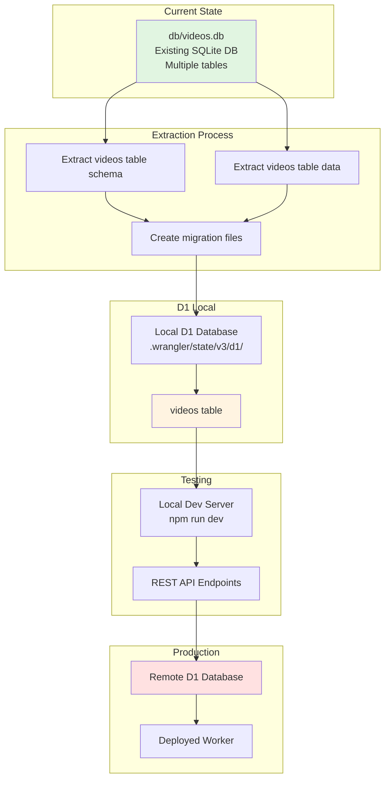

# Videos Table D1 Setup Plan

## Overview

This plan outlines how to extract the **videos table** from your existing `db/videos.db` SQLite database and import it into Wrangler D1 locally before deploying to Cloudflare D1.

## Key Understanding

**Important:** Wrangler D1's local mode creates its own SQLite database in `.wrangler/state/v3/d1/` and doesn't directly work with existing SQLite files. We'll extract just the `videos` table and import it into D1.

## Goal

Extract only the `videos` table from `db/videos.db` and import it into D1 for local development and eventual deployment.

---

## Step 1: Examine the Videos Table Schema

First, let's understand the structure of the `videos` table in `db/videos.db`:

```bash
# List all tables in videos.db (to confirm videos table exists)
sqlite3 db/videos.db "SELECT name FROM sqlite_master WHERE type='table';"

# Get schema for the videos table
sqlite3 db/videos.db "PRAGMA table_info(videos);"

# View sample data from videos table
sqlite3 db/videos.db "SELECT * FROM videos LIMIT 5;"

# Count records in videos table
sqlite3 db/videos.db "SELECT COUNT(*) FROM videos;"
```

---

## Step 2: Extract Videos Table Schema and Data

### Export the Videos Table Schema

```bash
# Export just the videos table schema
sqlite3 db/videos.db ".schema videos" > db/mutations/create_videos_table.sql
```

### Export the Videos Table Data

```bash
# Export all data from the videos table as INSERT statements
sqlite3 db/videos.db ".dump videos" > db/mutations/insert_videos.sql
```

**Note:** The `.dump videos` command will output both the CREATE TABLE statement and all INSERT statements for the videos table. You may want to separate them:
- `db/mutations/create_videos_table.sql` - Contains only the CREATE TABLE statement
- `db/mutations/insert_videos.sql` - Contains only the INSERT statements

---

## Step 2.5: Modify Schema (Remove Title and Description Columns)

**Note:** SQLite doesn't support `ALTER TABLE DROP COLUMN` directly in older versions. The recommended approach is to create a new table without the unwanted columns and migrate the data.

### Option A: Modify During Export (Recommended)

When exporting the schema, manually edit the CREATE TABLE statement to remove the `title` and `description` columns:

```bash
# Export the schema
sqlite3 db/videos.db ".schema videos" > db/mutations/create_videos_table.sql
```

Then edit `db/mutations/create_videos_table.sql` to remove the `title` and `description` columns from the CREATE TABLE statement.

### Option B: Create Modified Table in SQLite First

If you want to modify the original database first:

```bash
# Create a new table without title and description columns
sqlite3 db/videos.db "
CREATE TABLE videos_new (
    id INTEGER PRIMARY KEY AUTOINCREMENT,
    -- Add other columns here (excluding title and description)
    created_at DATETIME DEFAULT CURRENT_TIMESTAMP
);
"

# Copy data from old table to new table (excluding title and description)
sqlite3 db/videos.db "
INSERT INTO videos_new (id, -- other columns except title and description)
SELECT id, -- other columns except title and description
FROM videos;
"

# Drop the old table
sqlite3 db/videos.db "DROP TABLE videos;"

# Rename the new table
sqlite3 db/videos.db "ALTER TABLE videos_new RENAME TO videos;"
```

### Option C: Export Data Without Unwanted Columns

When exporting data, you can select only the columns you want:

```bash
# Export data excluding title and description columns
sqlite3 db/videos.db "
SELECT 'INSERT INTO videos (id, -- other columns) VALUES (' ||
    id || ', ' ||
    -- other columns except title and description
    ');'
FROM videos;
" > db/mutations/insert_videos.sql
```

### Recommended Approach

The simplest approach is to:

1. Export the schema: `sqlite3 db/videos.db ".schema videos" > db/mutations/create_videos_table.sql`
2. Manually edit `db/mutations/create_videos_table.sql` to remove `title` and `description` columns
3. Export data with only the columns you need:
   ```bash
   sqlite3 db/videos.db "SELECT * FROM videos;" > db/mutations/insert_videos.sql
   ```
4. Manually edit `db/mutations/insert_videos.sql` to remove `title` and `description` from INSERT statements

---

## Step 3: Import Videos Table into D1

### Using Existing D1 Database (`cf-demo-db`)

Your project already has a D1 database configured. We'll add the videos table to it:

```bash
# Create videos table in local D1
npx wrangler d1 execute cf-demo-db --local --file=db/mutations/create_videos_table.sql

# Insert all videos data
npx wrangler d1 execute cf-demo-db --local --file=db/mutations/insert_videos.sql
```

### Verify the Import

```bash
# Check if videos table exists
npx wrangler d1 execute cf-demo-db --local --command "SELECT name FROM sqlite_master WHERE type='table' AND name='videos';"

# Count records in videos table
npx wrangler d1 execute cf-demo-db --local --command "SELECT COUNT(*) FROM videos;"

# View sample data
npx wrangler d1 execute cf-demo-db --local --command "SELECT * FROM videos LIMIT 5;"
```

---

## Step 4: Create Helper Scripts (Optional)

Create TypeScript scripts similar to the existing users scripts for easier management:

```
scripts/
├── create_videos_table.ts       # Create videos table
└── insert_videos.ts             # Insert video data
```

And Nushell wrappers:

```
utils/nu-scripts/
├── create-videos-table.nu
└── insert-videos.nu
```

Example usage:
```bash
# Create videos table
create-videos-table

# Insert videos data
insert-videos
```

---

## Step 5: Test with Local Development Server

Start the local server and test the videos table:

```bash
# Start local development server
npm run dev

# Test REST API endpoints (make sure .dev.vars has your LOCAL_SECRET)
curl -H "Authorization: Bearer your-secret" http://localhost:8787/rest/videos

# Get a specific video by ID
curl -H "Authorization: Bearer your-secret" http://localhost:8787/rest/videos/1

# Filter videos
curl -H "Authorization: Bearer your-secret" "http://localhost:8787/rest/videos?title=example"

# Raw SQL query
curl -H "Authorization: Bearer your-secret" -H "Content-Type: application/json" \
  -d '{"query": "SELECT * FROM videos LIMIT 10;", "params": []}' \
  http://localhost:8787/query
```

---

## Step 6: Deploy to Production (Optional)

Once satisfied with local testing, deploy to Cloudflare D1:

```bash
# Apply schema to remote D1
npx wrangler d1 execute cf-demo-db --remote --file=db/mutations/create_videos_table.sql

# Insert data to remote D1
npx wrangler d1 execute cf-demo-db --remote --file=db/mutations/insert_videos.sql

# Deploy worker
npm run deploy
```

---

## Architecture Diagram



---

## Quick Start Commands

### Examine Videos Table
```bash
# List all tables
sqlite3 db/videos.db "SELECT name FROM sqlite_master WHERE type='table';"

# Get videos table schema
sqlite3 db/videos.db "PRAGMA table_info(videos);"

# View sample data
sqlite3 db/videos.db "SELECT * FROM videos LIMIT 5;"

# Count records
sqlite3 db/videos.db "SELECT COUNT(*) FROM videos;"

# Export videos table schema
sqlite3 db/videos.db ".schema videos" > db/mutations/create_videos_table.sql

# Export videos table data
sqlite3 db/videos.db ".dump videos" > db/mutations/insert_videos.sql
```

### Import into D1 Locally
```bash
# Create videos table in local D1
npx wrangler d1 execute cf-demo-db --local --file=db/mutations/create_videos_table.sql

# Insert videos data
npx wrangler d1 execute cf-demo-db --local --file=db/mutations/insert_videos.sql

# Verify import
npx wrangler d1 execute cf-demo-db --local --command "SELECT COUNT(*) FROM videos;"

# Start local dev server
npm run dev
```

---

## Next Steps

1. **Examine the videos table** in `db/videos.db` to understand its schema
2. **Export the schema** to `db/mutations/create_videos_table.sql`
3. **Export the data** to `db/mutations/insert_videos.sql`
4. **Execute migrations** on local D1 database
5. **Verify the import** with sample queries
6. **Test** with the REST API
7. **Deploy** to production when ready

---

## Summary

This plan focuses on extracting just the `videos` table from your existing `db/videos.db` and importing it into D1. The original `db/videos.db` file remains untouched, so you can continue using it for other purposes if needed.

The key steps are:
1. Export videos table schema and data
2. Import into D1's local database
3. Test with the REST API
4. Deploy to production when ready
