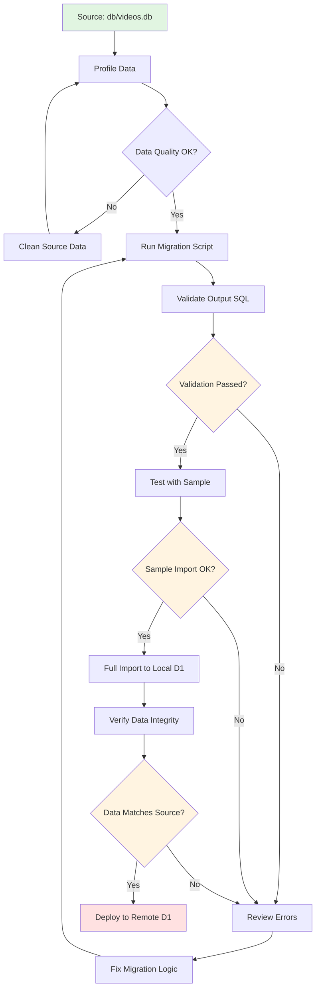

# Videos Table D1 Migration - Improved Plan

## Executive Summary

The current approach has **critical data parsing issues** that result in malformed SQL INSERT statements. This improved plan addresses these issues with a robust, validated migration strategy.

## Problems Identified with Current Approach

### 1. **Data Format Misunderstanding**
- **Issue**: The script assumes data is delimited by `$` characters, but the actual data uses `|` (pipe) delimiters
- **Impact**: Incorrect parsing leads to fields being split mid-content
- **Evidence**: Lines like `INSERT INTO videos (video_id, ...) VALUES ('100K AI Design System...` show titles being treated as video_ids

### 2. **Column Mapping Errors**
- **Issue**: The filter logic `columns.filter((_, index) => index !== 1 && index !== 3)` assumes fixed positions
- **Impact**: When data doesn't match expected format, wrong columns are removed
- **Evidence**: Many rows have empty strings for critical fields (channel_name, channel_id, etc.)

### 3. **No Data Validation**
- **Issue**: No validation of parsed data before generating SQL
- **Impact**: Malformed INSERT statements that will fail on execution
- **Evidence**: Rows with NULL values for required fields, misaligned data

### 4. **Memory Inefficiency**
- **Issue**: Loading entire file into memory with `fs.readFileSync()`
- **Impact**: Won't scale for large datasets (current file appears to have 500+ rows)
- **Risk**: Out of memory errors with larger datasets

### 5. **No Error Handling**
- **Issue**: No try-catch blocks, no validation, no error reporting
- **Impact**: Silent failures, difficult debugging
- **Evidence**: Script doesn't report which rows failed or why

---

## Recommended Solution: SQLite-to-D1 Direct Migration

### Why This Approach?

Instead of parsing text files, we should:
1. **Query the source SQLite database directly**
2. **Transform data in-memory with proper validation**
3. **Generate clean, validated SQL statements**
4. **Batch insert for performance**

### Benefits

✅ **Data Integrity**: Direct database queries ensure accurate data extraction  
✅ **Type Safety**: SQLite provides schema information  
✅ **Validation**: Can validate each row before generating SQL  
✅ **Performance**: Streaming/batching prevents memory issues  
✅ **Debugging**: Clear error messages for each failed row  
✅ **Testable**: Can write unit tests for transformation logic

---

## Improved Migration Strategy

### Phase 1: Analyze Source Data

```bash
# Examine the actual videos table structure
sqlite3 db/videos.db ".schema videos"

# Count total records
sqlite3 db/videos.db "SELECT COUNT(*) FROM videos;"

# Sample data to understand content
sqlite3 db/videos.db "SELECT * FROM videos LIMIT 3;"

# Check for NULL values in key columns
sqlite3 db/videos.db "
SELECT 
  COUNT(*) as total,
  COUNT(video_id) as has_video_id,
  COUNT(title) as has_title,
  COUNT(cleaned_title) as has_cleaned_title,
  COUNT(description) as has_description,
  COUNT(cleaned_description) as has_cleaned_description
FROM videos;
"
```

### Phase 2: Create Migration Script (Python Recommended)

**Why Python over TypeScript?**
- Better SQLite support with `sqlite3` module (built-in)
- Pandas for data validation and transformation
- More robust error handling for data operations
- Easier to test and debug

**Script Structure:**

```python
# scripts/migrate_videos_to_d1.py
import sqlite3
import json
from pathlib import Path
from typing import List, Dict, Any
import sys

class VideoMigration:
    def __init__(self, source_db: str, output_file: str, batch_size: int = 100):
        self.source_db = source_db
        self.output_file = output_file
        self.batch_size = batch_size
        self.errors = []
        
    def validate_row(self, row: Dict[str, Any]) -> tuple[bool, str]:
        """Validate a single row of data"""
        # Check required fields
        if not row.get('video_id'):
            return False, "Missing video_id"
        
        # Validate data types
        numeric_fields = ['duration_seconds', 'view_count', 'like_count', 'comment_count']
        for field in numeric_fields:
            if row.get(field) and not isinstance(row[field], (int, type(None))):
                return False, f"Invalid type for {field}"
        
        return True, ""
    
    def transform_row(self, row: Dict[str, Any]) -> Dict[str, Any]:
        """Transform row data (remove title and description)"""
        # Create new dict without title and description
        return {
            'video_id': row['video_id'],
            'cleaned_title': row.get('cleaned_title', ''),
            'cleaned_description': row.get('cleaned_description', ''),
            'channel_name': row.get('channel_name', ''),
            'channel_id': row.get('channel_id', ''),
            'published_at': row.get('published_at'),
            'duration_seconds': row.get('duration_seconds'),
            'view_count': row.get('view_count'),
            'like_count': row.get('like_count'),
            'comment_count': row.get('comment_count'),
            'is_indexed': row.get('is_indexed', 0),
            'created_at': row.get('created_at')
        }
    
    def escape_sql_string(self, value: Any) -> str:
        """Properly escape SQL strings"""
        if value is None:
            return 'NULL'
        if isinstance(value, (int, float)):
            return str(value)
        # Escape single quotes by doubling them
        return f"'{str(value).replace(chr(39), chr(39)+chr(39))}'"
    
    def generate_insert_statement(self, row: Dict[str, Any]) -> str:
        """Generate a single INSERT statement"""
        columns = ', '.join(row.keys())
        values = ', '.join(self.escape_sql_string(v) for v in row.values())
        return f"INSERT INTO videos ({columns}) VALUES ({values});"
    
    def migrate(self) -> tuple[int, int]:
        """Execute the migration"""
        conn = sqlite3.connect(self.source_db)
        conn.row_factory = sqlite3.Row  # Access columns by name
        cursor = conn.cursor()
        
        # Query all videos (excluding title and description)
        cursor.execute("""
            SELECT 
                video_id,
                cleaned_title,
                cleaned_description,
                channel_name,
                channel_id,
                published_at,
                duration_seconds,
                view_count,
                like_count,
                comment_count,
                is_indexed,
                created_at
            FROM videos
            ORDER BY created_at DESC
        """)
        
        successful = 0
        failed = 0
        statements = []
        
        for row in cursor:
            row_dict = dict(row)
            
            # Validate
            is_valid, error_msg = self.validate_row(row_dict)
            if not is_valid:
                self.errors.append({
                    'video_id': row_dict.get('video_id', 'UNKNOWN'),
                    'error': error_msg
                })
                failed += 1
                continue
            
            # Transform
            transformed = self.transform_row(row_dict)
            
            # Generate SQL
            sql = self.generate_insert_statement(transformed)
            statements.append(sql)
            successful += 1
            
            # Write in batches to avoid memory issues
            if len(statements) >= self.batch_size:
                self._write_batch(statements)
                statements = []
        
        # Write remaining statements
        if statements:
            self._write_batch(statements)
        
        conn.close()
        
        return successful, failed
    
    def _write_batch(self, statements: List[str]):
        """Write a batch of statements to file"""
        mode = 'a' if Path(self.output_file).exists() else 'w'
        with open(self.output_file, mode) as f:
            f.write('\n'.join(statements) + '\n')
    
    def report_errors(self):
        """Generate error report"""
        if not self.errors:
            print("✅ No errors!")
            return
        
        print(f"\n❌ {len(self.errors)} rows failed validation:\n")
        for error in self.errors[:10]:  # Show first 10
            print(f"  - video_id: {error['video_id']}")
            print(f"    error: {error['error']}\n")
        
        if len(self.errors) > 10:
            print(f"  ... and {len(self.errors) - 10} more errors")

if __name__ == "__main__":
    migrator = VideoMigration(
        source_db="db/videos.db",
        output_file="db/mutations/insert_videos_migrated.sql",
        batch_size=100
    )
    
    print("🚀 Starting migration...")
    successful, failed = migrator.migrate()
    
    print(f"\n📊 Migration Results:")
    print(f"  ✅ Successful: {successful}")
    print(f"  ❌ Failed: {failed}")
    print(f"  📁 Output: {migrator.output_file}")
    
    migrator.report_errors()
    
    # Exit with error code if any failures
    sys.exit(1 if failed > 0 else 0)
```

### Phase 3: Validation Script

Create a separate validation script to verify the generated SQL:

```python
# scripts/validate_migration.py
import re
from pathlib import Path

def validate_sql_file(filepath: str) -> tuple[int, List[str]]:
    """Validate generated SQL file"""
    errors = []
    line_count = 0
    
    with open(filepath, 'r') as f:
        for line_num, line in enumerate(f, 1):
            line_count += 1
            line = line.strip()
            
            if not line:
                continue
            
            # Check it's an INSERT statement
            if not line.startswith('INSERT INTO videos'):
                errors.append(f"Line {line_num}: Not an INSERT statement")
                continue
            
            # Check it ends with semicolon
            if not line.endswith(';'):
                errors.append(f"Line {line_num}: Missing semicolon")
            
            # Check for empty string values in critical fields
            if "'', ''" in line:
                errors.append(f"Line {line_num}: Contains empty critical fields")
            
            # Check for unescaped quotes (basic check)
            # Count single quotes - should be even
            quote_count = line.count("'")
            if quote_count % 2 != 0:
                errors.append(f"Line {line_num}: Unbalanced quotes")
    
    return line_count, errors

if __name__ == "__main__":
    filepath = "db/mutations/insert_videos_migrated.sql"
    
    print(f"🔍 Validating {filepath}...")
    count, errors = validate_sql_file(filepath)
    
    print(f"\n📊 Validation Results:")
    print(f"  📝 Total statements: {count}")
    print(f"  ❌ Errors found: {len(errors)}")
    
    if errors:
        print("\n❌ Errors:")
        for error in errors[:20]:  # Show first 20
            print(f"  - {error}")
        if len(errors) > 20:
            print(f"  ... and {len(errors) - 20} more errors")
    else:
        print("\n✅ All statements valid!")
```

### Phase 4: Test Migration Locally

```bash
# 1. Run migration script
uv run python scripts/migrate_videos_to_d1.py

# 2. Validate output
uv run python scripts/validate_migration.py

# 3. Test with small sample first
head -n 10 db/mutations/insert_videos_migrated.sql > db/mutations/test_sample.sql

# 4. Try importing sample to local D1
npx wrangler d1 execute cf-demo-db --local --file=db/mutations/test_sample.sql

# 5. Verify import
npx wrangler d1 execute cf-demo-db --local --command "SELECT COUNT(*) FROM videos;"
npx wrangler d1 execute cf-demo-db --local --command "SELECT * FROM videos LIMIT 5;"
```

### Phase 5: Full Migration

```bash
# Import all data
npx wrangler d1 execute cf-demo-db --local --file=db/mutations/insert_videos_migrated.sql

# Verify counts match
sqlite3 db/videos.db "SELECT COUNT(*) FROM videos;"
npx wrangler d1 execute cf-demo-db --local --command "SELECT COUNT(*) FROM videos;"

# Spot check data quality
npx wrangler d1 execute cf-demo-db --local --command "
SELECT 
  video_id,
  cleaned_title,
  channel_name,
  view_count
FROM videos 
WHERE cleaned_title IS NOT NULL 
  AND cleaned_title != ''
LIMIT 10;
"
```

---

## Alternative Approach: Use D1's Native Import

D1 can import from SQLite directly in some cases:

```bash
# Option A: Export specific columns from SQLite
sqlite3 db/videos.db <<EOF
.mode insert videos
.output db/mutations/videos_export.sql
SELECT 
  video_id,
  cleaned_title,
  cleaned_description,
  channel_name,
  channel_id,
  published_at,
  duration_seconds,
  view_count,
  like_count,
  comment_count,
  is_indexed,
  created_at
FROM videos;
.quit
EOF

# Option B: Use CSV as intermediate format
sqlite3 db/videos.db <<EOF
.mode csv
.output db/mutations/videos_export.csv
SELECT 
  video_id,
  cleaned_title,
  cleaned_description,
  channel_name,
  channel_id,
  published_at,
  duration_seconds,
  view_count,
  like_count,
  comment_count,
  is_indexed,
  created_at
FROM videos;
.quit
EOF
```

Then create a Python script to convert CSV to SQL with proper escaping.

---

## Data Quality Checks

### Pre-Migration Checks

```sql
-- Check for duplicate video_ids
SELECT video_id, COUNT(*) as count 
FROM videos 
GROUP BY video_id 
HAVING COUNT(*) > 1;

-- Check for NULL in primary key
SELECT COUNT(*) FROM videos WHERE video_id IS NULL;

-- Check data distribution
SELECT 
  COUNT(*) as total_videos,
  COUNT(DISTINCT channel_id) as unique_channels,
  AVG(duration_seconds) as avg_duration,
  MAX(view_count) as max_views
FROM videos;

-- Check for problematic characters
SELECT video_id, cleaned_title
FROM videos
WHERE cleaned_title LIKE '%''%'  -- Contains single quotes
   OR cleaned_title LIKE '%"%'   -- Contains double quotes
LIMIT 10;
```

### Post-Migration Checks

```sql
-- Verify record count matches
-- Run in both source and D1

-- Check for data integrity
SELECT 
  COUNT(*) as total,
  COUNT(DISTINCT video_id) as unique_ids,
  SUM(CASE WHEN cleaned_title = '' THEN 1 ELSE 0 END) as empty_titles,
  SUM(CASE WHEN channel_name = '' THEN 1 ELSE 0 END) as empty_channels
FROM videos;

-- Spot check specific records
SELECT * FROM videos WHERE video_id = 'BsWxPI9UM4c';
```

---

## Recommended Tools & Scripts

### Tool 1: Nu Shell Script (Wrapper)

```nu
# utils/nu-scripts/migrate-videos.nu
#!/usr/bin/env nu

# Migrate videos from SQLite to D1
def main [
    --validate-only  # Only validate, don't migrate
    --batch-size: int = 100  # Batch size for processing
] {
    print "🚀 Starting video migration..."
    
    if $validate_only {
        uv run python scripts/validate_migration.py
    } else {
        # Run migration
        uv run python scripts/migrate_videos_to_d1.py
        
        # Validate output
        uv run python scripts/validate_migration.py
        
        # Show summary
        print "\n📊 Migration complete! Review the output above."
    }
}
```

### Tool 2: Data Profiling Script

```python
# scripts/profile_videos_data.py
"""Profile the videos data to understand its structure"""
import sqlite3
import json

def profile_videos_table(db_path: str):
    conn = sqlite3.connect(db_path)
    cursor = conn.cursor()
    
    # Get schema
    cursor.execute("PRAGMA table_info(videos)")
    schema = cursor.fetchall()
    
    print("📋 Table Schema:")
    for col in schema:
        print(f"  {col[1]}: {col[2]} {'(PK)' if col[5] else ''}")
    
    # Get row count
    cursor.execute("SELECT COUNT(*) FROM videos")
    total = cursor.fetchone()[0]
    print(f"\n📊 Total Records: {total:,}")
    
    # Check for NULLs in each column
    print("\n🔍 NULL Value Analysis:")
    for col in schema:
        col_name = col[1]
        cursor.execute(f"SELECT COUNT(*) FROM videos WHERE {col_name} IS NULL")
        null_count = cursor.fetchone()[0]
        if null_count > 0:
            print(f"  {col_name}: {null_count:,} NULLs ({null_count/total*100:.1f}%)")
    
    # Check for empty strings
    print("\n📝 Empty String Analysis:")
    text_columns = ['cleaned_title', 'cleaned_description', 'channel_name', 'channel_id']
    for col in text_columns:
        cursor.execute(f"SELECT COUNT(*) FROM videos WHERE {col} = ''")
        empty_count = cursor.fetchone()[0]
        if empty_count > 0:
            print(f"  {col}: {empty_count:,} empty ({empty_count/total*100:.1f}%)")
    
    # Sample problematic rows
    print("\n⚠️  Sample Rows with Issues:")
    cursor.execute("""
        SELECT video_id, cleaned_title, channel_name 
        FROM videos 
        WHERE cleaned_title = '' OR channel_name = ''
        LIMIT 5
    """)
    for row in cursor.fetchall():
        print(f"  video_id: {row[0]}")
        print(f"    title: '{row[1]}'")
        print(f"    channel: '{row[2]}'")
    
    conn.close()

if __name__ == "__main__":
    profile_videos_table("db/videos.db")
```

---

## Migration Workflow Diagram



---

## Step-by-Step Execution Plan

### Step 1: Profile the Data (5 min)

```bash
uv run python scripts/profile_videos_data.py
```

**Expected Output:**
- Table schema
- Row counts
- NULL analysis
- Empty string analysis
- Sample problematic rows

### Step 2: Run Migration (10 min)

```bash
# Create output directory if needed
mkdir -p db/mutations

# Run migration
uv run python scripts/migrate_videos_to_d1.py

# Check output
wc -l db/mutations/insert_videos_migrated.sql
```

### Step 3: Validate Output (5 min)

```bash
uv run python scripts/validate_migration.py
```

### Step 4: Test Sample (5 min)

```bash
# Extract first 10 statements
head -n 10 db/mutations/insert_videos_migrated.sql > db/mutations/test_sample.sql

# Import to local D1
npx wrangler d1 execute cf-demo-db --local --file=db/mutations/test_sample.sql

# Verify
npx wrangler d1 execute cf-demo-db --local --command "SELECT * FROM videos LIMIT 5;"
```

### Step 5: Full Import (10 min)

```bash
# Import all data
npx wrangler d1 execute cf-demo-db --local --file=db/mutations/insert_videos_migrated.sql

# Verify counts
npx wrangler d1 execute cf-demo-db --local --command "SELECT COUNT(*) FROM videos;"

# Spot check data quality
npx wrangler d1 execute cf-demo-db --local --command "
SELECT video_id, cleaned_title, channel_name, view_count 
FROM videos 
WHERE cleaned_title != '' 
LIMIT 10;
"
```

---

## Handling Edge Cases

### Issue: Special Characters in Text

**Problem**: Titles/descriptions may contain:
- Single quotes (`'`)
- Double quotes (`"`)
- Newlines (`\n`)
- Unicode characters

**Solution**: Proper SQL escaping
```python
def escape_sql_string(value: str) -> str:
    if value is None:
        return 'NULL'
    # Double single quotes for SQL
    escaped = value.replace("'", "''")
    # Remove problematic characters
    escaped = escaped.replace('\n', ' ').replace('\r', ' ')
    return f"'{escaped}'"
```

### Issue: Large Text Fields

**Problem**: Some descriptions may be very long (>10KB)

**Solution**: Truncate or use TEXT type
```python
def truncate_if_needed(text: str, max_length: int = 5000) -> str:
    if len(text) > max_length:
        return text[:max_length] + '...'
    return text
```

### Issue: Invalid Timestamps

**Problem**: Timestamps may not be in correct format

**Solution**: Validate and convert
```python
from datetime import datetime

def validate_timestamp(ts: str) -> str:
    try:
        # Try parsing
        dt = datetime.fromisoformat(ts.replace('Z', '+00:00'))
        # Return in D1-compatible format
        return dt.strftime('%Y-%m-%d %H:%M:%S')
    except:
        # Return current timestamp as fallback
        return datetime.now().strftime('%Y-%m-%d %H:%M:%S')
```

---

## Performance Considerations

### Batch Size Tuning

- **Small batches (100 rows)**: Better error isolation, slower overall
- **Large batches (1000 rows)**: Faster, but harder to debug failures
- **Recommended**: Start with 100, increase to 500 after validation

### Memory Management

```python
# Instead of loading all at once:
# ❌ data = fs.readFileSync(inputFile, 'utf-8')

# Use streaming:
# ✅ Process row by row, write in batches
```

### D1 Import Optimization

```bash
# For very large datasets, split into multiple files
split -l 1000 db/mutations/insert_videos_migrated.sql db/mutations/batch_

# Import each batch
for file in db/mutations/batch_*; do
    npx wrangler d1 execute cf-demo-db --local --file="$file"
done
```

---

## Testing Strategy

### Unit Tests

```python
# tests/test_migration.py
import pytest
from scripts.migrate_videos_to_d1 import VideoMigration

def test_validate_row():
    migrator = VideoMigration("", "")
    
    # Valid row
    valid_row = {'video_id': 'abc123', 'cleaned_title': 'Test'}
    is_valid, msg = migrator.validate_row(valid_row)
    assert is_valid == True
    
    # Invalid row (missing video_id)
    invalid_row = {'cleaned_title': 'Test'}
    is_valid, msg = migrator.validate_row(invalid_row)
    assert is_valid == False
    assert 'video_id' in msg

def test_escape_sql_string():
    migrator = VideoMigration("", "")
    
    # Test single quote escaping
    result = migrator.escape_sql_string("It's a test")
    assert result == "'It''s a test'"
    
    # Test NULL handling
    result = migrator.escape_sql_string(None)
    assert result == 'NULL'
```

### Integration Tests

```bash
# Create test database with sample data
sqlite3 db/test_videos.db <<EOF
CREATE TABLE videos (
    video_id TEXT PRIMARY KEY,
    title TEXT,
    cleaned_title TEXT,
    description TEXT,
    cleaned_description TEXT,
    channel_name TEXT,
    channel_id TEXT,
    published_at TIMESTAMP,
    duration_seconds INTEGER,
    view_count INTEGER,
    like_count INTEGER,
    comment_count INTEGER,
    is_indexed BOOLEAN DEFAULT 0,
    created_at TIMESTAMP DEFAULT CURRENT_TIMESTAMP
);

INSERT INTO videos VALUES 
('test1', 'Original Title', 'Cleaned Title', 'Original Desc', 'Cleaned Desc', 'Channel', 'CH123', '2024-01-01', 100, 1000, 50, 10, 0, '2024-01-01'),
('test2', 'Title with ''quotes''', 'Clean Title', 'Desc', 'Clean Desc', 'Channel2', 'CH456', '2024-01-02', 200, 2000, 100, 20, 0, '2024-01-02');
EOF

# Run migration on test database
uv run python scripts/migrate_videos_to_d1.py --source db/test_videos.db --output db/mutations/test_output.sql

# Verify output
cat db/mutations/test_output.sql
```

---

## Rollback Strategy

### Before Migration

```bash
# Backup current D1 database
npx wrangler d1 execute cf-demo-db --local --command ".dump" > db/backups/d1_backup_$(date +%Y%m%d_%H%M%S).sql
```

### If Migration Fails

```bash
# Drop videos table
npx wrangler d1 execute cf-demo-db --local --command "DROP TABLE IF EXISTS videos;"

# Recreate table
npx wrangler d1 execute cf-demo-db --local --file=db/mutations/create_videos_table.sql

# Restore from backup if needed
npx wrangler d1 execute cf-demo-db --local --file=db/backups/d1_backup_YYYYMMDD_HHMMSS.sql
```

---

## Comparison: Current vs Improved Approach

| Aspect | Current Approach | Improved Approach |
|--------|-----------------|-------------------|
| **Data Source** | Text file with pipe delimiters | Direct SQLite query |
| **Parsing** | String splitting (error-prone) | SQLite row factory (reliable) |
| **Validation** | None | Row-by-row validation |
| **Error Handling** | None | Detailed error reporting |
| **Memory Usage** | Load entire file | Streaming with batches |
| **Debugging** | Difficult (no error context) | Easy (error per row) |
| **Testing** | No tests | Unit + integration tests |
| **Performance** | Single-threaded, in-memory | Batched, memory-efficient |
| **Maintainability** | Low (hardcoded indices) | High (named columns) |

---

## Quick Start Commands

### Setup

```bash
# Install Python dependencies (if using Python approach)
uv add sqlite3  # Usually built-in
uv add pandas   # Optional, for advanced validation

# Make scripts executable
chmod +x scripts/migrate_videos_to_d1.py
chmod +x scripts/validate_migration.py
chmod +x scripts/profile_videos_data.py
```

### Execute Migration

```bash
# 1. Profile source data
uv run python scripts/profile_videos_data.py

# 2. Run migration
uv run python scripts/migrate_videos_to_d1.py

# 3. Validate output
uv run python scripts/validate_migration.py

# 4. Test sample
head -n 10 db/mutations/insert_videos_migrated.sql > db/mutations/test_sample.sql
npx wrangler d1 execute cf-demo-db --local --file=db/mutations/test_sample.sql

# 5. Full import
npx wrangler d1 execute cf-demo-db --local --file=db/mutations/insert_videos_migrated.sql

# 6. Verify
npx wrangler d1 execute cf-demo-db --local --command "SELECT COUNT(*) FROM videos;"
```

---

## Next Steps

1. **Review this plan** - Does this approach make sense for your use case?

2. **Choose implementation**:
   - **Option A**: Python migration script (recommended)
   - **Option B**: SQLite `.dump` with post-processing
   - **Option C**: CSV intermediate format

3. **Decide on validation level**:
   - **Basic**: Just check SQL syntax
   - **Standard**: Validate required fields
   - **Strict**: Validate all data types and constraints

4. **Consider data cleaning**:
   - Should we clean empty strings before migration?
   - Should we set defaults for NULL values?
   - Should we truncate long text fields?

---

## Summary

The current approach has fundamental issues with data parsing that lead to malformed SQL statements. The improved approach:

1. ✅ **Queries SQLite directly** - eliminates parsing errors
2. ✅ **Validates each row** - catches issues before SQL generation
3. ✅ **Handles errors gracefully** - reports what failed and why
4. ✅ **Processes in batches** - prevents memory issues
5. ✅ **Includes testing** - ensures data integrity
6. ✅ **Provides rollback** - safe to retry if needed

**Recommendation**: Implement the Python-based migration script with validation, then test with a small sample before full migration.
